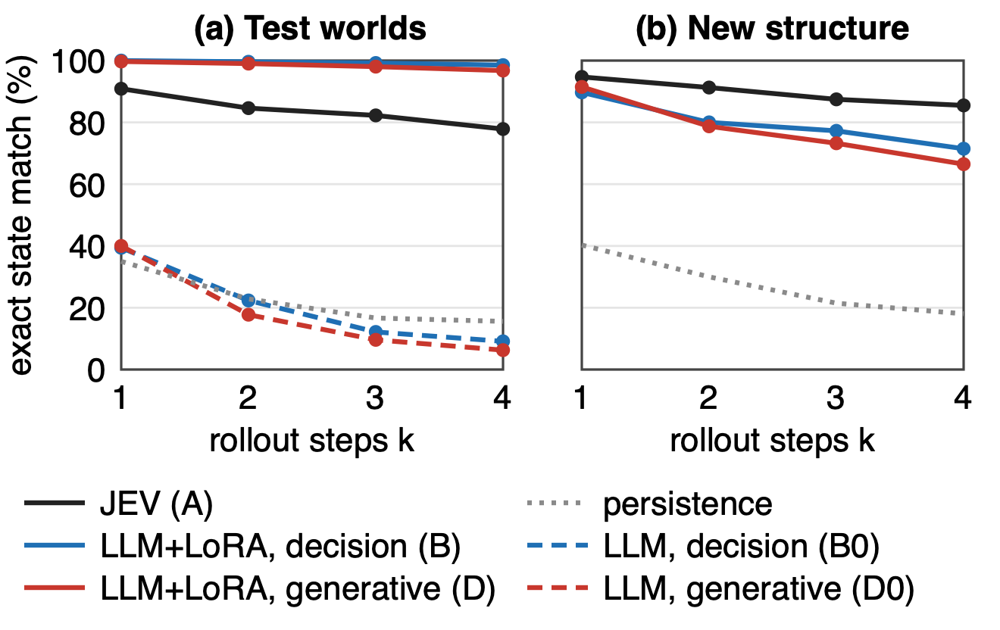
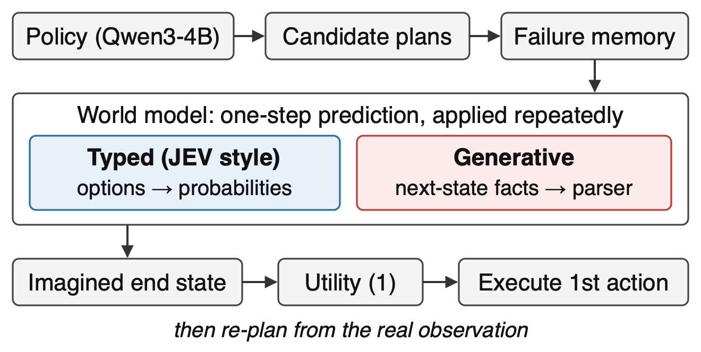
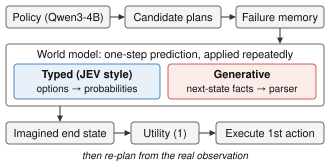

# LLM 에이전트의 월드모델

**결정모델과 범용 LLM의 비교**
(A World Model for LLM Agents: Comparing a Decision Model with General-Purpose LLMs)

[English](README.md) | 한국어

**한국지능시스템학회(KIIS) 2026 추계학술대회**(구두발표 부문, 2026년 11월 26–28일)에 투고한 논문의 코드·데이터·실행 기록·분석·원고 저장소입니다. 저자: **송용휘** (충북대학교 정보통신공학부), **이건명** (충북대학교 소프트웨어학부).

> **논문:** [`KIIS2026f_원고.pdf`](kiis2026f/paper/KIIS2026f_원고.pdf)가 완성 원고(2026-10-08, A4 2쪽, 학회 양식)이고, [`KIIS2026f_원고.docx`](kiis2026f/paper/KIIS2026f_원고.docx)는 제출용 파일, [`원고.md`](kiis2026f/paper/원고.md)는 같은 글의 Markdown입니다. PDF는 macOS에서 대체 글꼴로 렌더링한 것이라 학회 인쇄본과 줄바꿈이 조금 다를 수 있습니다.

---

## 1. 개요

LLM 에이전트는 행동의 결과를 모른 채 행동을 고르기 때문에 무효하거나 목표와 무관한 명령을 반복합니다. 행동을 실제로 하기 *전에* 결과를 예측하는 **월드 모델**이 이를 줄여 주며, 보통은 LLM에게 다음 상태를 글로 쓰게 하는 방식(학습 없이, 또는 파인튜닝해서)을 씁니다.

이 연구는 다른 질문을 던집니다. **글을 생성하지 않고 선택지 위의 확률로만 답하는 *결정 모델(decision model)* 을 에이전트의 월드 모델로 쓸 수 있는가?** 결정 모델로는 TypeSafe AI의 **JEV**(`jev-1.13.0`)를 **과제 학습 없이 그대로(frozen)** 쓰고, 행동 하나마다 질문 7개를 선택지로 묻습니다. *이 명령이 실행되는가?* 그리고 *실행 뒤 상태 변수 6개의 값은 무엇인가?* 그 답으로 다음 상태를 구성하고, 같은 과정을 반복해 여러 step을 내다봅니다.

같은 에이전트에 LLM 월드 모델을 끼워 **2 × 2 설계**(질의 방식 × 학습 유무)로 비교하며, 나머지는 모두 고정합니다.

| | 학습 없음 | 엔진이 라벨한 전이 6,000개로 학습 |
|---|---|---|
| **결정형** (선택지로 묻고 확률을 읽음) | **A** JEV (frozen) · **B0** Qwen3-4B | **B** Qwen3-4B + LoRA |
| **생성형** (다음 상태를 글로 쓰고 파싱) | **D0** Qwen3-4B | **D** Qwen3-4B + LoRA |
| 월드 모델 없음 | **C** 정책만 · **C_fm** 정책 + 실패 기억 | |
| 참조선 | **oracle** 같은 계획기에 엔진의 정답을 넣음 | |

모든 에이전트는 같은 정책(Qwen3-4B), 같은 후보 계획, 같은 계획기와 효용 함수를 씁니다. **월드 모델만 다릅니다.**

**세 가지 결과** (TextWorld, 처음 보는 이름의 평가 world 24개, 에이전트당 288 episode):

1. **frozen 결정 모델은 과제 학습 없이도 월드 모델로 쓸 수 있습니다.** JEV의 과제 성공률은 93.4 %로, 실패 기억만 쓰는 기준선(79.5 %)보다 높고 oracle(92.7 %)과 구분되지 않았습니다.
2. **학습 없는 LLM은 선택지로 물을 때가 다음 상태를 쓰게 할 때보다 높습니다** (83.0 % vs 59.0 %). 차이는 *형식*에서 옵니다. 생성한 상태의 26.0 %가 파싱되지 않았고, 파싱 실패 처리 규칙이 이를 "실행 안 됨"으로 바꿨습니다. 파싱된 답만 보면 생성형의 정확도는 낮지 않았습니다.
3. **파인튜닝은 학습한 구조에서는 차이를 없애지만 새 구조로 옮겨지지 않습니다.** LoRA로 학습한 B·D는 모든 episode에서 oracle과 같은 결과를 냈고 4 step 예측도 98.5 % / 96.8 %로 JEV(77.9 %)보다 정확했습니다. 그러나 학습에 없던 새 구조에서는 71.5 % / 66.5 %로 떨어진 반면 JEV는 85.5 %를 유지해, 하락폭이 JEV보다 25.6 · 26.7 %p 컸습니다.

---

## 2. 논문

| | |
|---|---|
| 국문 제목 | LLM 에이전트의 월드모델: 결정모델과 범용 LLM의 비교 |
| 영문 제목 | A World Model for LLM Agents: Comparing a Decision Model with General-Purpose LLMs |
| 저자 | 송용휘¹ · 이건명² — ¹충북대학교 정보통신공학부, ²충북대학교 소프트웨어학부 |
| 학회 | 한국지능시스템학회 2026 추계학술대회, 구두발표 부문, 논문번호 00027 |
| 상태 | 요약문 제출 2026-10-01 · 원고 완성 10-08 · 최종 논문 제출 10-23 · 학술대회 11-26~28 (김포대학교 글로벌캠퍼스) · Proceedings of KIIS Fall Conference 2026, Vol. 36, No. 2 |
| 형식 | A4 2쪽, 2단, 학회 Word 양식 |
| 키워드 | 월드 모델, LLM 에이전트, 결정 모델, 파인튜닝, TextWorld |

[`kiis2026f/paper/`](kiis2026f/paper/README.md)의 파일:

- [`원고.tmpl.md`](kiis2026f/paper/원고.tmpl.md) — 원고의 글. 숫자는 모두 이름 붙은 슬롯이고 `results/slots.json`에서 채워집니다. 숫자나 글이 전제한 판정이 바뀌면 빌드가 멈춥니다.
- [`원고.md`](kiis2026f/paper/원고.md), [`KIIS2026f_원고.docx`](kiis2026f/paper/KIIS2026f_원고.docx), [`KIIS2026f_원고.pdf`](kiis2026f/paper/KIIS2026f_원고.pdf) — 빌드 산출물 (`scripts/kiis_paper.py`).
- [`fig1.svg`](kiis2026f/paper/fig1.svg) (두 방식의 한 step 예측 예), [`fig2.png`](kiis2026f/paper/fig2.png) (rollout 정확도), [`fig_architecture.svg`](kiis2026f/paper/fig_architecture.svg) (시스템 구조도, 발표용).
- [`professor_report/`](kiis2026f/professor_report/) — 배경·방법·설정·결과·해석을 담은 12쪽 분량의 연구 설명서(docx). 같은 `slots.json`에서 만듭니다.

### 요약

선택지 위의 확률로 답하는 결정 모델 JEV를 LLM 에이전트의 월드 모델로 쓰는 방법을 제시하고, LLM을 그대로 또는 파인튜닝해 쓰는 방법과 비교한다. TextWorld 과제에서 과제 학습 없이 쓴 JEV의 성공률은 93.4 %로, 실패한 행동만 기억하는 에이전트(79.5 %)보다 높고 완벽한 예측을 넣은 기준(92.7 %)과 구분되지 않았다. 학습 없는 LLM은 선택지로 물으면 83.0 %, 다음 상태를 생성하게 하면 59.0 %였고, 이 차이는 생성한 상태의 26.0 %가 파싱되지 않는 데서 비롯됐다. 전이 6,000개로 파인튜닝한 LLM은 학습한 구조에서 92.7 %에 도달했지만, 새 구조에서는 다단계 예측 정확도가 JEV보다 25.6–26.7 %p 더 떨어졌다.

---

## 3. 결과

### 표 1 — closed-loop 과제 성공률 (평가 world 24 × 시작 상태 4 × 정책 seed 3 = 에이전트당 288 episode)

| 에이전트 | 성공률 (%) [95 % CI] | 무효율 (%) | 월드 모델 비용 / episode |
|---|---|---|---|
| C (정책만) | 17.0 [7.3, 29.2] | 87.8 | – |
| C_fm (+ 실패 기억) | 79.5 [70.5, 87.5] | 35.0 | – |
| **A (JEV, frozen)** | **93.4 [85.1, 98.6]** | 15.4 | 요청 129회, $0.010 |
| B0 (LLM, 결정형) | 83.0 [73.3, 91.3] | 48.6 | 49 GPU-s |
| D0 (LLM, 생성형) | 59.0 [48.6, 69.1] | 36.3 | 115 GPU-s |
| B (LLM + LoRA, 결정형) | 92.7 [85.8, 97.9] | 13.2 | 42 GPU-s |
| D (LLM + LoRA, 생성형) | 92.7 [85.8, 97.9] | 13.2 | 73 GPU-s |
| Oracle (엔진 정답) | 92.7 [85.8, 97.9] | 12.8 | – |

신뢰구간은 world 24개 단위 bootstrap(4,000회)입니다. B·D는 같은 전이 6,000개로 파인튜닝했습니다(13.9 · 4.5 GPU-h). 한 step 예측의 파싱 실패율은 D0 26.0 %, D 0.1 %입니다. B·D는 288 episode 모두에서 oracle과 성공 여부가 같았습니다.

핵심 짝차이: A − C_fm **+13.9 %p [2.1, 24.3]**, B0 − D0 **+24.0 %p [11.5, 35.8]**. A − oracle +0.7 [−1.7, 3.1]과 A − B0 +10.4 [−1.7, 21.5]는 이 표본으로는 *구분되지 않습니다*.

### 그림 2 — rollout 길이에 따른 상태 예측 정확도



k step을 예측한 뒤 beam 1위 상태의 변수가 모두 맞은 비율(상태 완전일치). (a) 평가 world의 rollout 800개, (b) 어떤 모델도 학습하지 않은 **새 구조**(곁방, 미끼 열쇠, 둘째 용기 추가, 상태 변수 9개)의 rollout 400개. *persistence*는 아무것도 바뀌지 않는다고 예측하는 바닥선입니다.

| k = 4 완전일치 | JEV (A) | B0 | B | D0 | D | persistence |
|---|---|---|---|---|---|---|
| 평가 world | 77.9 | 9.1 | **98.5** | 6.2 | 96.8 | 15.6 |
| 새 구조 | **85.5** | 4.2 | 71.5 | 2.2 | 66.5 | 18.0 |

학습 없는 LLM은 k = 2부터 persistence보다 낮습니다. JEV의 오류는 거의 전부 *실행 여부* 판단(한 step 7.0 %)이고, 그 판단이 맞으면 상태 오류는 0.0 %입니다.

### 그림 1 — 학습 없는 생성형이 실패하는 이유



D0의 가장 흔한 실패입니다. 사과의 새 위치를 쓰면서 옛 위치를 지우지 않아 한 물체가 두 곳에 있게 되고, 파싱되지 않으며, "한 번 재생성 뒤에도 파싱 실패 = 실행 안 됨" 규칙이 음식 집기에 벌점을 줍니다. 그러면 에이전트가 음식 없이 먼 방에 들어가(D0 40 %, C_fm 21 %) 거의 회복하지 못합니다.

### 사전에 정한 가설과 판정

모든 기대는 본 실행 전에 커밋했습니다([`kiis2026f/실험계획.md`](kiis2026f/실험계획.md) §5). world 단위 95 % CI가 0을 포함하는 차이는 "동등"이 아니라 *구분되지 않음*으로 적습니다.

| # | 기대 | closed-loop 성공률 | k-step 예측 |
|---|---|---|---|
| H1 | 월드 모델 > C | 성립 (A, B, D; +75 %p) | — |
| H1b | 월드 모델 > C_fm | 성립 (A +13.9, B/D +13.2) | — |
| H2 | 학습 없이 결정형 > 생성형 | 성립 (+24.0) | 경계 (+2.3 [−0.1, 4.6]) |
| H3 | 학습하면 방식 차이가 준다 | 성립 (−24.0) | 구분되지 않음 |
| H4 | 학습한 결정형 ≥ JEV | 구분되지 않음 (둘 다 oracle 수준) | 평가 world 성립 (+15.4), 새 구조에서는 **반대** (−10.1) |
| H5 | JEV > 학습 없는 LLM | 구분되지 않음 (+10.4) | 성립 (+63.2) |
| H6 | k가 늘면 떨어지고 학습 없는 생성형이 가장 많이 | — | 성립 (D0 k=1→4 −33.8 %p) |
| H7 | 새 구조에서 학습한 모델이 JEV보다 더 떨어진다 | — | 성립 (하락폭 B +25.6, D +26.7 더 큼) |
| H8 | 같은 LLM에서 결정형의 오류 누적이 작다 | — | 구분되지 않음 |

전체 수치: [`kiis2026f/results/slots.json`](kiis2026f/results/slots.json), [`artifacts/kiis_k4v3/README.md`](artifacts/kiis_k4v3/README.md), [`artifacts/kiis_k5v3/README.md`](artifacts/kiis_k5v3/README.md).

### 이 연구가 주장하지 *않는* 것

논문 구성안에는 데이터가 뒷받침하지 못하는 주장 목록이 있습니다([`kiis2026f/논문구성안.md`](kiis2026f/논문구성안.md) §9). 주요 항목:

- 결정형이 생성형보다 *더 정확한* 월드 모델이라고 보이지 않았습니다. 파싱된 답만 보면 D0가 B0보다 낮지 않았습니다. 이점은 **형식 견고성**이고, 그 크기는 파싱 실패 처리 규칙에 달려 있습니다.
- closed-loop에서 JEV와 파인튜닝한 LLM 중 어느 쪽이 낫다고 보이지 않았습니다. 셋 다 oracle 수준입니다.
- 과제 구조 하나, LLM 하나(Qwen3-4B), 학습 seed 하나, 파싱 규칙 하나 밖으로는 주장하지 않습니다. 평가 world는 이름만 새롭고 구조는 학습과 같습니다(평가 전이의 69.5 %가 이름만 다른 채 학습 데이터에 있음). 새 구조의 결과는 rollout 측정만입니다.
- oracle은 진단용 참조선이지 성능 상한이 아닙니다. 남은 실패는 후보 부족과 계획기의 한계이며 월드 모델의 오류가 아닙니다.

---

## 4. 방법



**에이전트 루프 (receding horizon).** 매 step 정책(Qwen3-4B, 샘플링 T = 0.7)이 길이 2의 후보 계획을 최대 16개 제안합니다. 계획기는 길이 1–2의 모든 prefix에 대해 월드 모델로 끝 상태를 상상하고 효용을 계산합니다.

```
J = conj + 0.25·progress − 0.1·E[무효 명령 수] − 0.01·h + 0.05·정책 사전값
```

*conj*는 목표 원자 세 개가 모두 성립할 확률, *progress*는 성립한 비율입니다. 가장 좋은 prefix의 첫 행동만 실행하고 실제 관측에서 다시 계획합니다. 현재 상태에서 이미 실패한 명령으로 시작하는 prefix는 제외합니다(실패 기억, 계획하는 모든 에이전트에 공통). 계수는 설계 문서에서 정했고 한 번도 튜닝하지 않았습니다.

**월드 모델 = 한 step 예측의 반복.** 모든 월드 모델에게는 언제나 "이 상태에서 이 명령 하나"만 묻습니다. 여러 step은 예측한 상태를 다시 입력해 굴립니다. 폭 4의 beam이 *실행* / *실패* 가지를 실행 확률로 가중해 들고 갑니다(생성형은 확률이 없어 사실상 beam 1). 전이 규칙은 코드 어디에도 없습니다. 다음 상태는 예측한 변수값만으로 재구성되며, roundtrip 테스트가 이 재구성에 손실이 없음을 보장합니다.

**결정형 질의 (A, B0, B).** (상태, 명령) 하나에 요청 두 개를 보냅니다. 하나는 상태 변수 6개의 질문(플레이어의 방, 열쇠와 두 음식의 위치, 상자와 문의 열림·닫힘·잠김)이고 타입상 가능한 값을 모두 선택지로 줍니다. 다른 하나는 명령이 실행되는지를 *따로* 묻습니다. 분리가 중요합니다. 상태 질문과 묶어 보내면 판단이 "실행" 쪽으로 쏠립니다(측정값 0.285 → 0.576). LLM의 선택지 확률은 선택지 글자의 다음 토큰 분포를 정규화한 값입니다. JEV는 공개된 확률 인터페이스만 씁니다.

**생성형 질의 (D0, D).** LLM이 `result: executes|fails`와 결과 상태의 모든 사실을 `predicate(arg, arg)` 줄로 씁니다. 엄격한 파서가 변수마다 정확히 하나의 합법 값을 요구합니다. 파싱되지 않은 답은 한 번 다시 생성(샘플링)하고, 그래도 실패하면 "실행 안 됨, 상태 유지"로 채점합니다.

**파인튜닝 (B, D).** 학습 world 150개에서 얻은 같은 전이 6,000개를 게임 엔진이 라벨합니다(JEV 출력은 쓰지 않음). LoRA r = 16, α = 32, dropout 0.05, 모든 attention·MLP projection. 손실은 정답 토큰에만. AdamW lr 1e-4, 워밍업 3 %, micro-batch 8,192 토큰 × accumulation 4, 2 epoch, val 전이 200개의 전이 정확도로 epoch 선택. B는 전이당 질문 7개의 한 토큰 답(예제 42,000개)을, D는 전이당 사실 목록 하나를 배웁니다. 검증: B0 52 % → B 100 %, D0 40 % → D 100 %.

**공정성 장치.** 정책의 난수 seed는 (world, 시작 상태, step)에만 걸려 있어, 같은 상태에서는 모든 에이전트가 똑같은 후보를 받습니다. 정책이 후보를 낼 때는 LoRA 어댑터를 끕니다. 모든 실행은 *조건 해시*(고정 설정 전부)와 *arm 해시*를 기록하고, 분석 스크립트는 해시가 다른 로그를 섞지 않습니다.

---

## 5. 실험 설정

| | |
|---|---|
| 환경 | TextWorld 1.7.0, symbolic JSON backend, 완전관측, 결정론. 정책에는 정적 명령 catalog만 주고 "지금 실행 가능한 명령 목록"은 주지 않습니다. |
| 과제 | 방 두 개. 닫힌 상자 안에 잠긴 문의 열쇠, 탁자 위에 목표 음식, 바닥에 미끼 음식. 목표는 목표 음식을 들고 문을 연 채 먼 방에 있기. 최단 풀이 6개 행동. |
| world | 구조는 같고 world마다 어휘가 다릅니다. **어휘로** 분할: dev 12 / train 150 / val 20 / **test 24** (학습·보정에 한 번도 나오지 않은 단어). world 지문은 `kiis2026f/worlds_manifest_v3.json`에 고정. |
| episode | test world 24 × 시작 상태 4 × 정책 seed 3 = **에이전트당 288**, 에이전트 9개, step 상한 30. |
| rollout 평가 | 평가 world에서 길이 4의 rollout 800개(시작 400 × {정책 계획, 무작위 행동열}), 새 구조(X1)에서 400개. 지표는 k = 1..4의 상태 완전일치. teacher-forced 대 자유 rollout(오류 누적)과 beam 1 대조도 측정. |
| 통계 | 독립 단위는 world. world 단위 bootstrap(4,000회) 95 % CI. 에이전트 비교는 같은 (seed, world, 시작 상태)의 짝차이. |
| 보정 | 과제 난이도와 정책 프롬프트는 dev·val world에서 **월드 모델 없는 에이전트만으로** 정했습니다(미리 정한 기준 G1–G5: oracle 90 % 이상, oracle − validity 격차, 후보 커버리지, C ≤ 20 %, 단조성). test world를 보고 코드·프롬프트·계수를 바꾼 적이 없습니다. |
| 장비 | JEV 호출·라벨링·분석은 로컬 Mac. Qwen3-4B 추론과 LoRA 학습은 RTX A5000 24 GB × 2 연구실 서버. |
| 최종 실행 비용 | JEV $2.77(closed-loop) + $2.42(rollout). GPU: closed-loop 벽시계 약 53시간(GPU 2장), rollout 44.9 GPU-h, 학습 18.5 GPU-h. |

---

## 6. 저장소 구조

```
.
├── README.md · README.ko.md
├── 아이디어.md            연구 제안서: 질문, JEV 분석, 구조 후보 다섯 가지 (9/20)
├── 설계.md                구현 설계: 인터페이스, 효용, 학습, 평가, MVP 계획
├── src/
│   ├── env/              worlds.py (world 생성, 어휘 분할, 지문) · serialize.py (canonical state)
│   │                     transitions.py (엔진이 라벨한 한 step 전이)
│   ├── agent/            policy.py (Qwen3-4B 후보 계획기) · task.py (목표, 상태 schema, 효용, 실패 기억)
│   ├── wm/               recursive_forecaster.py (한 step rollout, beam) · jev_forecaster.py · llm_backends.py
│   ├── jev_client.py     jev-1.13.0 고정, schema 검증, 예산 상한, 재시도, 원시 응답 보관
│   ├── forecast.py       JEV 요청 빌더
│   └── runinfo.py        조건 해시, arm 해시, 코드 revision
├── scripts/              파이프라인 단계(§7)와 MVP 시기 스크립트
├── tests/                독립 실행형 회귀 테스트 13개 (roundtrip, parity, 파서 누출, 계약, bootstrap)
├── data/
│   ├── phase2/worlds     world 정의 320개
│   ├── kiis/             전이 세트와 rollout 파일 (큰 .jsonl은 git 제외)
│   └── mvp_a/            MVP 시기의 엔진 라벨 반사실 데이터셋
├── artifacts/            모든 실행: run_manifest.json, 로그, 요약, 단계별 README
│   ├── kiis_k4v3/        closed-loop 본 실행 (표 1), hypotheses.json, 실패 원인 재생
│   ├── kiis_k5v3/ kiis_x1v3/   rollout 평가 (그림 2), 오류 누적
│   ├── kiis_k3/          LoRA 학습 기록과 검증 게이트
│   ├── kiis_wcal/ kiis_v1cal/ kiis_v1bcal/   보정 실행 (월드 모델 없는 에이전트만)
│   └── mvp_b/ mvp_c/ wm_criteria/ …          MVP 시기 결과 (이전 조건, 표 1에 쓰지 않음)
├── kiis2026f/            논문 작업 폴더
│   ├── paper/            원고 소스, 빌드 산출물, 그림
│   ├── results/          slots.json, 표 1, 그림 2 — scripts/kiis_report.py가 생성
│   ├── professor_report/ 연구 설명서(docx)와 빌더
│   ├── 실험계획.md         실험 계획: 에이전트 정의, 고정 조건, 단계 K0–K7, 가설, 변경 기록
│   ├── 논문구성안.md       논문 구성안: 결과 슬롯 R1–R20, 쓰지 않을 주장, 발표 구성
│   ├── 전체_실험_해설.md   모든 실험·결정·이유의 해설서
│   ├── 공개_LLM_월드모델_JEV_비교계획.md   다음 연구 계획 (ScienceWorld / ALFWorld)
│   └── worlds_manifest*.json   고정한 world 지문
├── docs/                 MVP 시기 프로토콜(확증/탐색 구분), 주장 대장, 한계 대장, arm A 설계
├── fullpaper/            확장 논문(저널) 계획
├── environment.lock      로컬 쪽 Python 패키지 고정
└── .env.example          TYPESAFE_API_KEY 자리
```

계획·기록 문서는 대부분 한국어이고, 코드·로그·manifest는 영어입니다.

**저장소에 없는 것.** JEV 원시 요청·응답(`artifacts/jev_raw/`)은 TypeSafe 이용약관상 공개 범위가 확인되지 않아 집계값만 공개합니다. episode 단위 `.jsonl` 로그와 LoRA 어댑터 가중치는 용량 때문에 제외했습니다. 이 파일들이 있는 기기에서는 `kiis_report.py --check`가 `slots.json`을 다시 계산해 대조합니다.

---

## 7. 재현

### 환경

```bash
python -m venv .venv && .venv/bin/pip install -r <(grep -v '^#' environment.lock)   # 로컬 쪽: textworld, httpx, …
cp .env.example .env                                                                 # TYPESAFE_API_KEY=…
.venv/bin/python scripts/phase0_api_check.py                                         # jev-1.13.0과 schema 확인
```

GPU 쪽은 Python 3.10, `torch 2.6.0+cu124`, `transformers 5.17.0`, `peft 0.21.0`, `textworld 1.7.0`, `Qwen/Qwen3-4B` bf16(24 GB GPU당 프로세스 2개)을 썼습니다.

### 테스트 (GPU·API 키 불필요)

```bash
for t in tests/test_*.py; do .venv/bin/python "$t" || break; done
```

### 파이프라인 (단계 이름은 `kiis2026f/실험계획.md`를 따름)

| 단계 | 명령 | 산출물 |
|---|---|---|
| K0 world | `scripts/kiis_worlds.py` | `kiis2026f/worlds_manifest_v3.json` |
| K2 전이 | `scripts/kiis_transitions.py --v3` | `data/kiis/transitions_v3/` |
| K3 학습 | `scripts/kiis_train_wm.py --style typed\|gen --n 6000 --epochs 2 --lr 1e-4 --micro-tokens 8192 --accum 4 --eval-n 200 --seed 0 --out …` | 어댑터, `train_meta.json` |
| K3 검증 | `scripts/kiis_validate_wm.py --adapter …` · `scripts/kiis_check_k3.py` | 게이트 14개 |
| W 보정 | `scripts/kiis_calibrate.py` | `artifacts/kiis_wcal/` |
| K4 closed-loop | `scripts/kiis_k4_queue.py --version v3` (arm마다 `scripts/mvp_c_headroom.py` 실행) | `artifacts/kiis_k4v3/` |
| K4 분석 | `scripts/kiis_k4_hypotheses.py` · `scripts/kiis_k4_ceiling.py` · `scripts/kiis_k4_replay.py` | `hypotheses.json`, 실패 원인 |
| K5 rollout | `REUSE_ROLLOUTS=1 bash scripts/kiis_run_k5v3.sh` (→ `scripts/kiis_k5_rollout.py build/eval/report/compare/accumulation`) | `artifacts/kiis_k5v3/`, `kiis_x1v3/` |
| K6 수치 | `scripts/kiis_report.py` (`--check`로 검증) | `kiis2026f/results/` |
| K7 원고 | `python3 scripts/kiis_paper.py --pdf` (macOS + Word) | `kiis2026f/paper/` |

모든 실행은 조건 해시(최종 v3 조건 `448b4fac3efe`), arm 해시, 코드 revision, 패키지 버전, 사용한 world의 지문을 `run_manifest.json`에 기록합니다.

---

## 8. 연구 진행 과정

이전 결과를 무효로 만든 설계 변경까지 모두 저장소에 기록되어 있습니다. 날짜는 2026년입니다.

| 날짜 | 단계 | 내용 |
|---|---|---|
| 9/20 | 제안·설계 | 연구 질문, JEV 공개 인터페이스로 할 수 있는 것과 없는 것의 분석, 구조 후보 다섯 가지. |
| 9/21 | Phase 0, MVP-A/B/C | API 고정. 엔진 라벨 반사실 데이터셋(라벨 위반 0). JEV의 "행동열 전체 뒤의 상태" 한 번 예측은 정상 실행 경로에서 100 % 정확했지만 **사전 등록한 순서 교환 검사에 0/18로 실패**. oracle의 여지는 기본 에이전트 대비 +60 %p이고 대부분 행동 유효성. |
| 9/22 | 구조 전환 | 실행 여부를 직접 물으면 92 %. **재귀 한 step 예측** 구조가 월드 모델의 조작적 조건 세 가지를 모두 통과(순서 교환 14/18). 실패 기억, 무효 수 벌점, 질문 분리를 고침. |
| 9/23 | KIIS 계획, K0–K1 | 2 × 2 + C 설계, 조건을 해시로 동결, 어휘 기반 분할, dev world 파일럿. |
| 9/24 | K2–K3 | 결정형·생성형 학습 파이프라인, tiny overfit 점검, B(13.9 GPU-h)·D(4.5 GPU-h) LoRA 학습, 검증 게이트 14/14. |
| 9/26 | K4 v1, K5 v1 | closed-loop 2,304 episode: **좋은 월드 모델이 모두 oracle과 같은 58.7 %** — oracle 실패의 76 %가 정책이 필요한 행동을 후보에 내지 않아서. rollout 평가는 작동(JEV k = 4 81.9 %). 결정: v1은 기록으로 남기고 dev·val에서만 과제를 다시 보정. |
| 9/26–27 | v2 | 미리 정한 기준으로 월드 모델 없는 에이전트만으로 보정, B·D 재학습. v2 pilot에서 보정이 test 이름으로 옮겨지지 않음을 확인. 결정: v3. |
| 9/27–28 | v3 (W) | 새 test 어휘, 더 엄격한 기준(oracle ≥ 90 %, 단조성), 반복을 깨는 프롬프트 레버. v1 어댑터가 v3 val 재사용 점검을 통과. |
| 9/28–30 | K4v3, K5v3, X1 | seed 3개로 closed-loop 2,592 episode와 rollout 1,200개 × 모델 5개. API 장애, OOM, 스케줄러 수정을 모두 기록하며 완료. |
| 9/30 | K6, K7 | 모든 수치를 로그에서 `slots.json`으로 계산. 짝차이 bootstrap을 world가 두 번 뽑히면 두 번 세도록 수정. 원고 초고와 개정. |
| 10/1–8 | 제출 | 요약문 제출(논문번호 00027). 연구 설명서 작성. 제목·저자 확정, 원고 완성(10/8). |

---

## 9. 한계와 다음 단계

결과는 과제 구조 하나, LLM 하나, 학습 seed 하나, 파싱 실패 규칙 하나에서 얻은 것입니다. 평가 world는 학습 world와 구조가 같아 파인튜닝 모델의 거의 완벽한 test 수치는 학습 분포 안의 값이며, 구조 밖 측정은 rollout 평가뿐입니다. JEV 응답은 비결정적이고(세 번 반복에서 rollout 칸의 7.5 %가 달라짐), 상태 변수 schema는 연구자가 설계한 것입니다. 계획기는 두 행동만 내다봅니다.

확장 계획([`fullpaper/`](fullpaper/README.md), [`kiis2026f/공개_LLM_월드모델_JEV_비교계획.md`](kiis2026f/공개_LLM_월드모델_JEV_비교계획.md))은 ScienceWorld와 ALFWorld로 옮겨 공개 생성형 월드 모델과 비교하고, 학습 데이터 양 곡선과 더 긴 horizon을 더하며, 생성형 출력에 schema 제약을 걸어도 형식 견고성의 이점이 남는지 확인합니다.

---

## 10. 인용

```bibtex
@inproceedings{song2026worldmodel,
  title     = {A World Model for LLM Agents: Comparing a Decision Model with General-Purpose LLMs},
  author    = {Song, Yong Hwi and Lee, Keon Myung},
  booktitle = {Proceedings of the KIIS 2026 Fall Conference (Korean Institute of Intelligent Systems), Vol. 36, No. 2},
  year      = {2026},
  note      = {Oral presentation. Korean title: LLM 에이전트의 월드모델: 결정모델과 범용 LLM의 비교}
}
```

[`CITATION.cff`](CITATION.cff)도 참고하세요.

## 11. 라이선스와 감사

코드는 [MIT License](LICENSE)로 공개합니다. 원고·그림·보고서는 © 2026 저자. TextWorld는 MIT(Microsoft), Qwen3-4B는 Apache-2.0(Alibaba)이며, JEV는 TypeSafe AI의 상용 API로 원시 출력은 여기서 재배포하지 않습니다.

**연락처:** 송용휘 (Yong Hwi Song) · thddydgnl1937@gmail.com · [github.com/thddydgnl](https://github.com/thddydgnl)
